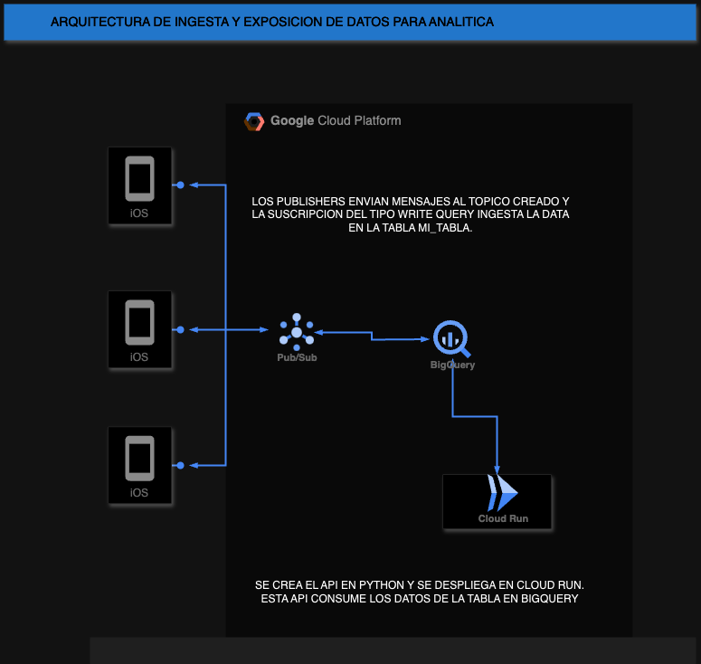

# LATAM AIRLINES CHALLENGE #

Este documento README tiene el proposito de documentar la solución de cada parte del desafío a entregar maximo el dia lunes 1 de julio.

### Parte 1:Infraestructura e IaC ###

1. Identificar la infraestructura necesaria para ingestar, almacenar y exponer datos:
a. Utilizar el esquema Pub/Sub (no confundir con servicio Pub/Sub de Google)
para ingesta de datos
b. Base de datos para el almacenamiento enfocado en analítica de datos
c. Endpoint HTTP para servir parte de los datos almacenados

**Solución**

Teniendo en cuenta el esquema Pub/Sub proponemos los siguientes servicios en la nube GCP para abordar el desafio

1.  **Pub/Sub**:
    
 Este es el servicio que va a recibir datos de múltiples fuentes, como aplicaciones, sensores, o sistemas en línea, y distribuir esos datos a varios consumidores, en este caso, a un sistema de procesamiento de datos.

2.  **Base de Datos de Análisis - Big Query**:
    
Esta base de datos de GCP permite almacenar grandes volúmenes de datos en un formato optimizado para análisis de datos.

3.  **API para Exposición de Datos - Cloud Run**:
    
Cloud Run es una plataforma que permite ejecutar contenedores en un entorno completamente gestionado, lo que lo hace ideal para aplicaciones basadas en microservicios o APIs que necesitan escalar automáticamente según la demanda.

4.  **Autenticación y Seguridad - IAM(Service Account)**:
    
Este servicio es para poder autenticar entre servicios con los roles adecuados de acuerdo a la funcion que realizaran.

### Conexión y Flujo de Datos

1.  **Ingesta de Datos**:
    
Las fuentes de datos publican mensajes a los temas(topics) configurados en el sistema Pub/Sub.

2.  **Almacenamiento de Datos**:
    
La base de datos de análisis recibe y almacena los datos transformados, manteniéndolos listos para consultas y análisis rápidos.

3.  **Exposición de Datos**:
    
La API extrae los datos de la base de datos de análisis conforme a las solicitudes de los usuarios y devuelve los resultados a través de endpoints HTTP.
La autenticación y las políticas de seguridad en IAM garantizan que solo los usuarios autorizados puedan acceder a los datos.

2. (Opcional) Deployar infraestructura mediante Terraform de la manera que más te
acomode. Incluir código fuente Terraform. No requiere pipeline CI/CD.

**Solución**

Se agrega la carpeta ./infraestructura con los archivos en terraform

### Parte 2: Aplicaciones y flujo CI/CD ###

1. API HTTP: Levantar un endpoint HTTP con lógica que lea datos de base de datos y
los exponga al recibir una petición GET

**Solución**

Se levanta un endpoint con python y flask de framework, el codigo se encuentra en ./app.py, lo que hace la aplicacion es leer
una tabla en el dataset de bigquery, latam-challenge, que se creo con terraform en la parte anterior.
Se agrega inicialmente un registro de datos para verificar la exposicion de datos.
Se genera el dockerfile para poder verificar el endpoint con postman primero localmente, luego se sube a la nube, para ello 
se hace uso de Cloud Run Service, previamente la imagen generada se sube al repositorio (us-central1-docker.pkg.dev/latam-challenge-427922/latam-challenge)

El API esta expuesto en https://api-srv-zfwnqi5ayq-uc.a.run.app/books

2. Deployar API HTTP en la nube mediante CI/CD a tu elección. Flujo CI/CD y
ejecuciones deben estar visibles en el repositorio git.

S

3. (Opcional) Ingesta: Agregar suscripción al sistema Pub/Sub con lógica para ingresar
los datos recibidos a la base de datos. El objetivo es que los mensajes recibidos en
un tópico se guarden en la base de datos. No requiere CI/CD.

La ingesta se da con una simulacion en el archivo (publish.py)

4. Incluye un diagrama de arquitectura con la infraestructura del punto 1.1 y su
interacción con los servicios/aplicaciones que demuestra el proceso end-to-end de
ingesta hasta el consumo por la API HTTP

Comentarios:
- Recomendamos usar un servicio serverless mediante Dockerfile para optimizar el tiempo de
desarrollo y deployment para la API HTTP
- Es posible que lógica de ingesta se incluya nativamente por tu servicio en la nube. De ser así,
solo comentar cómo funciona
- Al ser 1.3 opcional, el flujo de ingesta de datos quedará incompleto, está bien
- Para el punto 1.4 no se requiere

### Parte 3: Pruebas de Integración y Puntos Críticos de Calidad ###

1. Implementa en el flujo CI/CD en test de integración que verifique que la API
efectivamente está exponiendo los datos de la base de datos. Argumenta.

**Solución**

Se implementa con pytest un test de integración que verifique la conexión y la exposición correcta de los datos desde la base de datos por parte de la API. Esto asegura que la API no sólo está operativa sino que también interactúa adecuadamente con la base de datos. 

Este test es crucial porque valida que la capa de integración entre la base de datos y la API funcione según lo esperado. Fallas en esta área podrían llevar a datos incorrectos o a la falta de disponibilidad de estos, afectando directamente la usabilidad de la aplicación.

2. Proponer otras pruebas de integración que validen que el sistema está funcionando
correctamente y cómo se implementarían.

**Solución**

Pruebas de Carga: Validar cómo la API maneja un número elevado de solicitudes simultáneas. Implementación mediante herramientas como JMeter o Locust.

Pruebas de Fallos: Simular fallos en las dependencias (como la base de datos) y observar la respuesta de la API. Se pueden usar herramientas como Chaos Monkey para introducir estos fallos de manera controlada.

3. Identificar posibles puntos críticos del sistema (a nivel de fallo o performance)
diferentes al punto anterior y proponer formas de testearlos o medirlos (no
implementar)

**Solución**
4. Proponer cómo robustecer técnicamente el sistema para compensar o solucionar
dichos puntos críticos

**Solución**

Comentarios:
- Los test de integración no necesariamente deben cubrir todos los casos de uso

### Parte 4: Métricas y Monitoreo ###

1. Proponer 3 métricas (además de las básicas CPU/RAM/DISK USAGE) críticas para
entender la salud y rendimiento del sistema end-to-end

**Solución**

Métricas Críticas

* Tasa de Errores: Proporción de solicitudes fallidas frente a solicitudes totales.
* Tiempo de Respuesta: Tiempo que toma procesar una solicitud.
* Saturación: Nivel de carga que soporta la API antes de degradar el servicio.

2. Proponer una herramienta de visualización y describe textualmente qué métricas
mostraría, y cómo esta información nos permitiría entender la salud del sistema para
tomar decisiones estratégicas

**Solución**

Grafana.
Métricas a Mostrar: Tasa de errores, tiempo de respuesta, saturación, CPU, RAM y uso de disco.
Beneficios: Permite una visualización en tiempo real del estado del sistema, ayudando a tomar decisiones proactivas para prevenir fallos.

3. Describe a grandes rasgos cómo sería la implementación de esta herramienta en la
nube y cómo esta recolectaría las métricas del sistema

**Solución**

Se podria montar en una instancia de compute engine un grafana con prometheus. Este podria ser con un docker compose tener los dos contenedores cada uno con sus configuraciones.

4. Describe cómo cambiará la visualización si escalamos la solución a 50 sistemas
similares y qué otras métricas o formas de visualización nos permite desbloquear
este escalamiento.

**Solución**

Al escalar a 50 sistemas similares, la visualización y el monitoreo se vuelven más complejos debido al volumen incrementado de datos y la necesidad de diferenciar el rendimiento y la salud entre múltiples sistemas. Aquí están los ajustes y nuevas capacidades que deberías considerar:

Dashboard Dinámico en Grafana: Utilizar etiquetas o tags para agrupar sistemas por características como la región, el tipo de servicio, o la carga de trabajo. Esto permite a los usuarios filtrar y comparar fácilmente los sistemas relevantes.
Agregación de Métricas: Para obtener una visión general y comparativa, se deberían agregar métricas como el tiempo de respuesta promedio, tasa de errores, y uso de recursos a nivel de grupo de sistemas o de toda la empresa.
Alertas Contextuales: Configurar alertas que consideren el contexto del sistema. Por ejemplo, una carga alta podría ser normal para un sistema en horario pico, pero indicativa de un problema para otro en horas no pico.
Métricas de Eficiencia de Escalado: Monitorear cómo la adición de nuevos sistemas afecta a la eficiencia general, por ejemplo, el rendimiento por núcleo o por GB de RAM, para asegurar que el escalado es efectivamente mejorando la capacidad sin degradar la eficiencia.

5. Comenta qué dificultades o limitaciones podrían surgir a nivel de observabilidad de
los sistemas de no abordarse correctamente el problema de escalabilidad

**Solución**

Problemas Potenciales:
Si no se aborda correctamente el problema de escalabilidad en el monitoreo y la observabilidad, pueden surgir varios problemas y limitaciones:

Sobrecarga de Datos: La infraestructura de monitoreo puede verse abrumada por el volumen de datos generados por 50 sistemas, lo que puede resultar en lentitud en la actualización de dashboards, alertas perdidas o datos incompletos.
Retrasos en la Identificación de Problemas: Con muchos sistemas, identificar rápidamente la causa raíz de los problemas puede ser desafiante. Las métricas mal diseñadas o la falta de adecuadas visualizaciones pueden ocultar problemas hasta que ya han causado impactos significativos.
Costo de Almacenamiento y Procesamiento: Almacenar y procesar un gran volumen de métricas puede ser costoso. Las estrategias ineficientes pueden conducir a gastos excesivos sin mejorar la observabilidad.
Complejidad de Gestión: Manejar alertas y configuraciones para múltiples sistemas puede volverse intrincadamente complejo, especialmente si las configuraciones no están centralizadas o automatizadas.
Soluciones Recomendadas:

Escalabilidad de la Infraestructura de Monitoreo: Asegurarse de que la solución de monitoreo puede escalar horizontalmente. Usar servicios que permitan el escalado automático basado en la carga, como Prometheus en un clúster de Kubernetes.
Optimización del Almacenamiento de Datos: Implementar políticas de retención de datos y agregación de métricas para reducir la cantidad de datos almacenados sin perder granularidad crítica para el diagnóstico.
Centralización y Automatización: Utilizar herramientas de gestión de configuración para mantener las alertas y las métricas configuradas de manera consistente y centralizada. Automatizar las respuestas a problemas comunes para reducir la carga operativa.